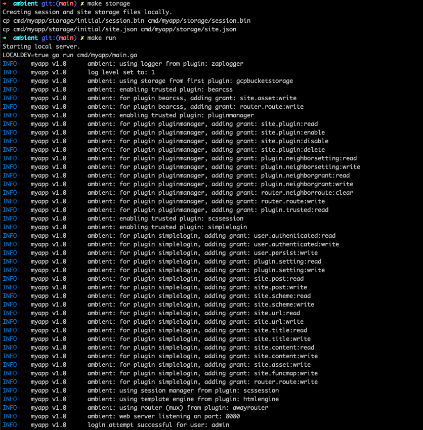
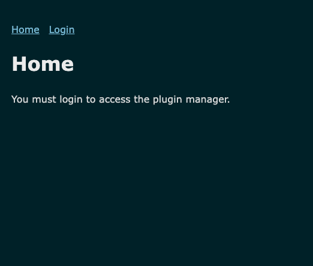
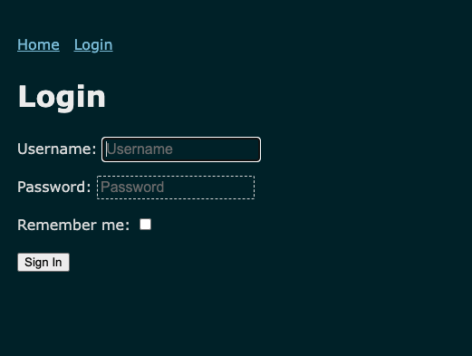
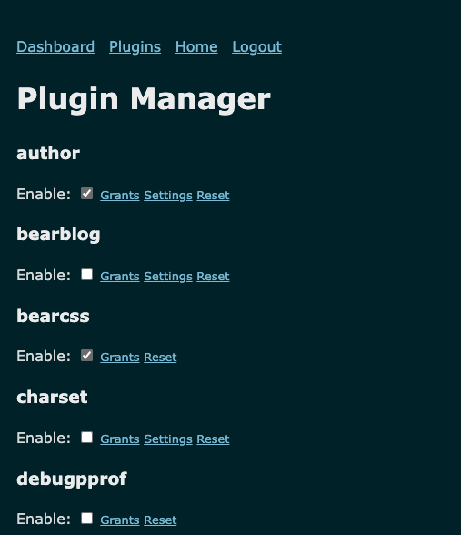
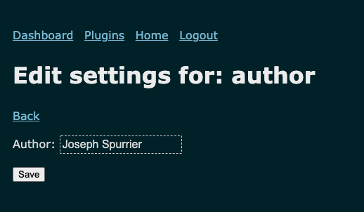
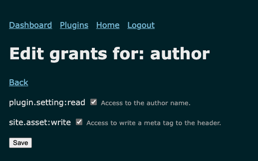
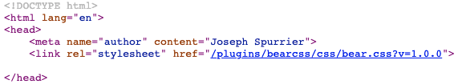
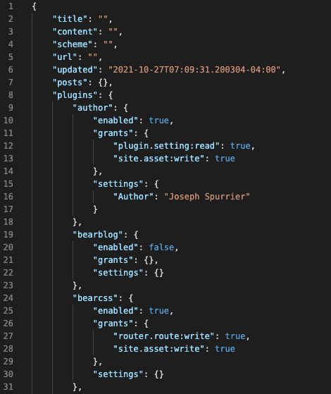

# Ambient 🏖️  <!-- omit in toc -->

- [Overview](#overview)
  - [What is it?](#what-is-it)
  - [Why was this created?](#why-was-this-created)
  - [Who is this for?](#who-is-this-for)
  - [How does it work?](#how-does-it-work)
- [Screenshots](#screenshots)

## Overview

### What is it?

Ambient is a framework in Go for building web apps using plugins. You can use the plugins already included to stand up a blog just like the [Bear Blog](https://bearblog.dev/) or create your own plugins to build your own web app. Plugins can be enabled/disabled while the app is running which means routes as well as middleware can also modified without restarting the app. Plugins must be granted permissions above being enabled which provides you with better control over your web app.

Use the [Sample App Tutorial](https://github.com/josephspurrier/ambient-template/blob/main/README.md) to quickly get the sample app running locally.

Use the [Deployment Guide](https://github.com/josephspurrier/ambient-template/blob/main/DEPLOYMENT.md) to deploy serverless on Google Cloud (Cloud Run), AWS (App Runner), or Azure (Functions).

Use the [Plugin Development Guide](https://github.com/josephspurrier/ambient-template/blob/main/PLUGIN.md) to build your own plugins.

### Why was this created?

Each time I write a new web app, there is a lot of foundational code reuse. I created Ambient to help myself standardize existing code, enable/disable packages on demand, modify plugin behaviors using a configurable settings page, and build new functionality in a reusable way.

### Who is this for?

Ambient will probably appeal to individual developers or small development teams who need to build one or many web apps using a pluggable framework. Large teams will probably want a more established framework - but if you find it works well, drop me a [line](/../../issues/new) 😁 .

### How does it work?

Ambient is a web server that accepts an app name, app version, logger, storage system, and a collection of plugins (which must include a router, template engine, and session manager).

Plugins:
- have to satisfy [interfaces](ambient.go) in order to work with Ambient.
- must request permissions and the admin must grant each permission.
- can modify or interact with almost any part of a web app:
  - logging
  - session management
  - URL handling/routing for pages and API endpoints
  - middleware on routes
  - page templates
  - content for HTML head, content, navigation, footer, etc.

A [pluginmanager plugin](plugin/generic/pluginmanager/pluginmanager.go) is included that allows you to:
  - Enable/disable a plugin
  - Grant permissions to a plugin
  - Modify the settings for a plugin

There is a [library of plugins](plugin) that you can use in your apps or use as a reference when creating your own plugins.

## Screenshots

Below are screenshots of the sample app with links to the plugins to help explain the architecture.

The terminal shows the [logger plugin](plugin/logger/zaplogger/zaplogger.go) that outputs based on log level.

The home screen is from the [simplelogin plugin](plugin/generic/simplelogin/simplelogin.go) and demonstrates the styling from the [bearcss plugin](plugin/generic/bearcss/bearcss.go). Routing is handled through the [awayrouter plugin](plugin/router/awayrouter/awayrouter.go).

The login page takes a username and password (handled by the [simplelogin plugin](plugin/generic/simplelogin/simplelogin.go)). The password hash is read from the environment variable: `AMB_PASSWORD_HASH`. The [scssession plugin](plugin/sessionmanager/scssession/scssession.go) handles the session creation and stores to the local filesystem, but supports any storage system via a plugin that satisfies the [`SessionStorer`](ambient_sessionstorer.go) interface.

The [pluginmanager plugin](plugin/generic/pluginmanager/pluginmanager.go) provides an easy way to modify plugins.

The settings page (part of the [pluginmanager plugin](plugin/generic/pluginmanager/pluginmanager.go)) allows you to customize the value that gets displayed in the meta tag that is set by the [author plugin](plugin/generic/author/author.go).

The grants page (part of the [pluginmanager plugin](plugin/generic/pluginmanager/pluginmanager.go)) allows you to allow or deny modifications to the app by the [author plugin](plugin/generic/author/author.go).

Once enabled, the [author plugin](plugin/generic/author/author.go) modifies the HTML header (through the [htmlengine plugin](plugin/templateengine/htmlengine/htmlengine.go)) to add in a meta tag with the value from the settings page.

The backend storage is provided by the [gcpbucketstorage plugin](plugin/storage/gcpbucketstorage/gcpbucketstorage.go) and is stored in a JSON file on the local filesystem, but supports any storage system via a plugin that satisfies the [`DataStorer`](ambient_datastorer.go) interface.

